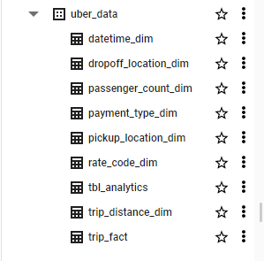

# Uber Data Analytics | Data Engineering GCP Project

## Introduction

The goal of this project is to perform data analytics on Uber data using various tools and technologies, including GCP Storage, Python, Compute Instance, Mage Data Pipeline Tool, BigQuery, and Looker Studio.

## Implementation Details
1. Layout data pipeline architecture.

2. Host Uber data (CSV file) on staging storage (google storage).
 
3. Set up Google Compute Instance (VM) with Python and Mage to handle the ETL process.
  
4. Model the data into various tables (star schema).

5. Write [Python scripts](https://github.com/Phylake1337/uber-data-pipeline-end2end/tree/main/mage-files) on Mage to:
- Extract data from google cloud.
- Transform, filter, and split the data into multiple tables.
- Load the data into BigQuery schema.

6. Create a [new analytics table](https://github.com/Phylake1337/uber-data-pipeline-end2end/blob/main/analytics_query.sql) to feed [Looker Dashbaord](https://lookerstudio.google.com/u/0/reporting/3692e76a-578f-4329-ba0c-a22e410b3f2b/page/j9pXD).

7. Set up [Looker Dashbaord](https://lookerstudio.google.com/u/0/reporting/3692e76a-578f-4329-ba0c-a22e410b3f2b/page/j9pXD) to visualize the data into different charts.

## Technology Used
- Programming Language - Python

Google Cloud Platform
1. Google Storage
2. Compute Instance 
3. BigQuery
4. Looker Studio

## Dataset Used
TLC Trip Record Data
Yellow and green taxi trip records include fields capturing pick-up and drop-off dates/times, pick-up and drop-off locations, trip distances, itemized fares, rate types, payment types, and driver-reported passenger counts. 

More info about the dataset can be found here:
1. [Website](https://www.nyc.gov/site/tlc/about/tlc-trip-record-data.page)
2. [Data Dictionary](https://www.nyc.gov/assets/tlc/downloads/pdf/data_dictionary_trip_records_yellow.pdf)

